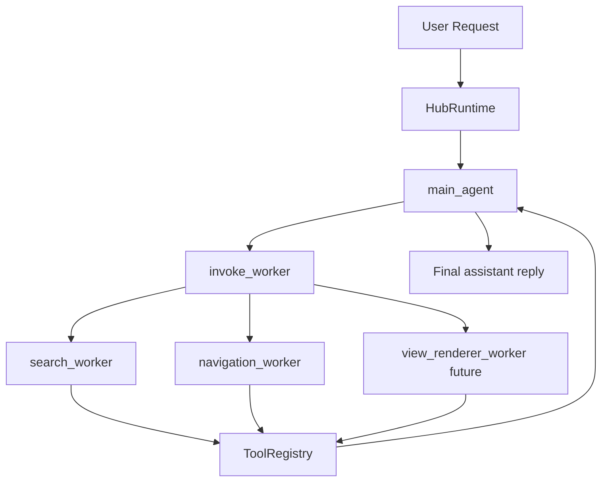

# 主 agent / worker 二级多智能体改造方案（讨论稿）

更新时间：2026-04-08（定稿版，暂不实施）

范围：围绕 `backend/app/agent` 的运行时、prompt、会话状态、SSE 事件和 API 协议做方案冻结；本轮只沉淀设计，不直接改业务代码。

## 1. 本轮先冻结的结论

1. 会话入口固定为 `main_agent`，不再从 `intent_router` 开始。
2. 这里的 `session` 定义为：前端围绕一个问题发起的一次 agent 系列操作；在这个定义下，同一 `session` 允许多个 worker 在后台并行运行。
3. `intent_router` 与 `summary_agent` 不再作为独立 subagent 存在，它们的职责内联到 `main_agent`。
4. `search_agent`、`navigation_agent` 升级为 `search_worker`、`navigation_worker`，只负责执行任务和返回结构化结果。
5. `main_agent` 通过 `invoke_worker` 发起 worker 执行；这是一种“有输入/有输出”的控制动作，不再是旧 `select_next_subagent` 那种纯跳转指针。
6. `invoke_worker` 的主输入改为自然语言任务文本，而不是深层 JSON `input`；这段任务文本本质上就是主 agent 当轮产出的可执行 brief。
7. worker 的结束条件改为：模型本轮不再返回 `tool_calls`，则 runtime 将该 worker 视为完成并收集返回值。
8. `summary_tool` 与 `select_next_subagent` 都不再属于主路径依赖；其中 `select_next_subagent` 只保留为过渡兼容层。
9. 权限策略采用“按 agent profile 白名单注入工具”，但主 agent 拥有全部工具调用权限作为兜底，worker 默认也允许使用全部 MCP 工具。
10. worker 返回给主 agent 的 envelope 必须包含结构化结果和简洁 `summary`，便于主 agent 消费，也便于后续写入 memory / SSE / 调试面板。
11. worker 应在独立沙箱上下文里运行；其本地 scratchpad 与工具轨迹不直接污染主 agent 上下文，只通过 envelope 和 runtime 认可的 artifacts 回流。
12. 主 agent 应改为“事件驱动唤醒”而不是空转：分配完 worker 且自身工作完成后进入 idle，等待用户输入或 worker 通知再开启下一轮 loop。
13. worker 失败允许自动重试，最多追加 2 次 retry，也就是最多 3 次 attempt。
14. 运行时整体应向异步队列模型演进，这样后续才能自然支持多个 worker 并发执行；并行 fan-out 不是可选方向，而是应被架构正向支持。

## 2. 基于当前代码的现状差距

| 位置 | 当前行为 | 为什么必须改 |
| --- | --- | --- |
| `backend/app/agent/runtime/react_runtime.py` | 每轮入口强制 `state.active_subagent = "intent_router"` | 与“主 agent 固定入口”冲突 |
| `backend/app/agent/runtime/tool_action_observer.py` | 每次 tool 执行后立即根据 `TransitionPolicy` 修改 `state.active_subagent` | 把业务工具结果和阶段切换硬绑在一起 |
| `backend/app/agent/orchestration/transition_policy.py` | 同时编码 `db_query_tool` / `route_plan_tool` 与 `summary_agent` 跳转 | 这是链式流程的中心耦合点 |
| `backend/app/agent/subagents/subagent_builder.py` | profile 仍是 `intent_router/search_agent/navigation_agent/summary_agent`，且 `allowed_tools` 含 `select_next_subagent` | profile 形态还停留在链式架构 |
| `backend/app/agent/llm/provider_adapter.py` | 对 `intent_router` 强制 `tool_choice="required"` | 说明 provider 层已经内建旧链路假设 |
| `backend/app/agent/context/prompts/*.md` | prompt 里明确要求“交给 `summary_agent`”或调用 `select_next_subagent` | prompt 也在强化旧协议 |
| `backend/app/agent/runtime/session_state.py` / `backend/app/protocol/messages.py` | 对外暴露 `active_subagent`，没有 worker run 或 agent scope 概念 | 不足以承载二级多智能体状态 |
| `backend/app/agent/tools/builtin/select_next_subagent_tool.py` | 作为 builtin tool 继续参与正式执行链 | 与“worker 自然结束”目标冲突 |

除了显式切换问题，当前还有一个隐性耦合：

1. `ToolActionObserver._apply_tool_memory()` 会把工具结果直接写进共享 `working_memory`。
2. `reply`、`shops`、`route` 等共享字段同时被多个阶段复用。
3. 这在链式模式下还能工作，但在主 agent / worker 模式下会让 worker 的局部过程污染主会话全局状态。

## 3. 目标形态



核心不是把链条换个名字，而是把职责分层：

1. `main_agent` 只负责理解用户目标、决定是否调用 worker、整合 worker 结果、最终面向用户答复。
2. worker 只负责完成一个明确任务，可以多轮调用工具，但不负责最终用户态总结。
3. runtime 负责解释“worker 什么时候结束、worker 结果如何回到 main agent、哪些信息能写回会话状态”。

## 4. 核心协议设计

### 4.1 Agent 角色与权限

| Agent | Phase 1 允许能力 | 输出类型 | 备注 |
| --- | --- | --- | --- |
| `main_agent` | `invoke_worker`、全部 builtin tools、`mcp__*` | 用户可见最终文本 | 主调度者，同时保留全权限兜底 |
| `search_worker` | 白名单 builtin tools、`mcp__*` | `SearchWorkerResult` | 白名单首批至少包含 `db_query_tool` |
| `navigation_worker` | 白名单 builtin tools、`mcp__*` | `NavigationWorkerResult` | 白名单首批包含 `db_query_tool`、`geo_resolve_tool`、`route_plan_tool` |
| `view_renderer_worker` | 白名单 builtin tools、`mcp__*` | `RendererWorkerResult` | 暂不进入本次主干改造 |

这里的权限策略从“硬阉割能力”改成“按 profile 白名单注入工具，但保留主 agent 全权限兜底”。

这样做的原因是：

1. 失败路径下，主 agent 不会因为没有工具权限而直接瘫掉。
2. MCP 工具天然是外来能力，若在工程上对每个 worker 做精细切片，维护成本会很高。
3. 当前项目已经有 `ToolPermissionChecker` 与 `allowed_tools` 注入链路，天然适合继续沿用“白名单注入”模型。

建议明确几个边界：

1. worker 不能再调用 `invoke_worker`。
2. Phase 1 不做 worker 间直接通信，所有结果都先回 `main_agent`。
3. `reply` 字段只允许 `main_agent` 写入。
4. 主 agent 虽然有全部工具权限，但 prompt 上仍应明确“优先派工给 worker，直接调用工具只用于简单路径或失败兜底”。

实现上建议继续复用现有模式：

1. `SubAgentBuilder` / agent profile 维护每个 agent 的 `allowed_tools` 白名单。
2. `ToolRegistry.tool_definitions()` 只注入当前 agent 被允许看到的工具。
3. `ToolPermissionChecker.ensure_allowed()` 仍作为最终兜底校验。
4. 对 worker 默认允许 `mcp__*`，对 builtin tools 则继续按白名单收口。

### 4.2 `invoke_worker` 不是旧 pointer tool 的翻版

建议新增一个主控工具，但主输入改为自然语言 brief，而不是复杂 JSON `input`。推荐形态例如：

```json
{
  "worker": "search_worker",
  "task": "用户想找上海附近 maimai 多的机厅。优先按 maimai 数量排序；如果地理范围不够明确，优先结合当前定位和最近一轮请求里的城市信息；找到后给出最值得推荐的几家。"
}
```

其中：

1. `worker` 仍然结构化，方便 runtime 选择 profile。
2. `task` 是主 agent 产出的实际派工内容，建议直接来自该轮模型回复语义，而不是让模型拼一个深层 `input` 对象。
3. 如需补充结构化 hints，优先由 runtime 从现有 request / artifacts 推导，而不是要求模型手写复杂参数。

这意味着 `invoke_worker` 更接近主流 agent 框架里的“dispatch with brief”，而不是“RPC with full JSON payload”。

建议 runtime 在 worker 侧这样消费：

1. worker system prompt 描述角色和工具边界。
2. 主 agent 的 `task` 作为 worker 的第一条核心输入消息。
3. runtime 再附加裁剪后的上下文块，而不是把整个主会话原样塞进去。

其返回值应是一个稳定的 envelope：

```json
{
  "worker": "search_worker",
  "run_id": "wrk_01H...",
  "status": "completed",
  "result": {
    "summary": "Found 3 candidate shops.",
    "total": 3,
    "shops": []
  },
  "artifacts": {
    "shops": [],
    "total": 3
  },
  "missing_fields": [],
  "error": null
}
```

它与旧 `select_next_subagent` 的区别是：

1. `invoke_worker` 表达的是“执行一个明确任务并返回结果”，不是“告诉系统跳到下一个阶段”。
2. 主 agent 拿到的是可消费结果，而不是一个模糊的 `next_subagent` 提示。
3. runtime 可以把 worker 视为一个可组合能力单元，后续也更容易扩展到新 worker。
4. 派工文本是给 worker 的真实工作说明，而不是只给 runtime 看的中间字段。

### 4.3 Worker 的自然结束协议

worker 运行循环建议收敛为下面四条：

1. 如果模型返回 `tool_calls`，则继续执行工具并把结果写入该 worker 的局部 scratchpad。
2. 如果模型不再返回 `tool_calls`，则视为 worker 完成。
3. 完成时 runtime 解析 `model_response.text`，校验为该 worker 的结果 schema。
4. 如果 schema 校验失败，runtime 仍返回 envelope，但状态标记为 `failed` 或 `completed` + `format_warning`，不能再默默回到链式跳转。

Phase 1 推荐结果状态先收敛为三种：

1. `completed`: worker 已拿到足够结果。
2. `needs_input`: worker 无法继续，需要用户补字段。
3. `failed`: 工具或结果解析失败。

这里的关键是：worker 的结束由 runtime 解释，而不是由某个工具宣告。

### 4.4 Worker 结果 schema 建议

推荐采用“通用 envelope + worker 专属 result”的双层结构，并要求每个 worker 都返回一段面向主 agent 的 `summary`。

通用 envelope：

```json
{
  "worker": "search_worker",
  "status": "completed",
  "summary": "human readable summary for main agent",
  "artifacts": {},
  "missing_fields": [],
  "error": null,
  "meta": {}
}
```

这里的 `summary` 不等于最终对用户回复，而是：

1. 供 `main_agent` 快速消费的执行摘要。
2. 供 session memory / worker_runs 列表记录的稳定摘要。
3. 供 SSE / 调试日志 / 历史 UI 直接展示的可读文本。

`SearchWorkerResult` 建议字段：

1. `summary`
2. `total`
3. `shops`
4. `selected_shop`
5. `query`
6. `needs_clarification`
7. `missing_fields`

`NavigationWorkerResult` 建议字段：

1. `summary`
2. `destination`
3. `route`
4. `provider`
5. `needs_clarification`
6. `missing_fields`

建议 dispatch 和 return 采用非对称设计：

1. main -> worker：自由文本 brief 为主，减少主 agent 拼 JSON 的脆弱性。
2. worker -> main：结构化 envelope 为主，减少主 agent 消费结果时的不稳定性。

这样做的目的不是把 schema 做得很大，而是让 `main_agent` 看到的是“清晰稳定的 worker 结果”，而不是杂糅的 tool 输出。

### 4.5 Worker 沙箱、memory 回流与 artifact 提升

worker 运行时建议采用“局部沙箱 + 受控回流”模型：

1. 每个 worker run 拥有自己的 local scratchpad。
2. worker 内部工具结果先写入 worker 本地上下文，而不是直接写主会话根级 memory。
3. worker 完成后，runtime 将其 envelope 写入 `worker_runs`。
4. runtime 再从 envelope 的 `artifacts` 中选择可提升项，合并进会话级 `artifacts`。

推荐的数据流：

```text
main_agent
  -> invoke_worker(task)
  -> worker sandbox
       -> local tool trace
       -> local scratchpad
       -> final envelope(summary/result/artifacts)
  -> runtime persists worker_runs[]
  -> runtime promotes selected artifacts
  -> main_agent sees summary + promoted artifacts
```

这样做的好处：

1. worker 可以独立运行，不会把中间噪音塞满主 agent 上下文。
2. worker 的完整结果仍然被保存在 memory 中，便于重放、调试和 UI 展示。
3. 主 agent 只消费“结果摘要 + 被提升的 artifacts”，不会被原始工具轨迹污染。

### 4.6 `artifact` 的定义

这里的 `artifact` 不是泛指“任何结果”，而是一个更窄的概念：

`artifact = 可被跨 loop、跨 agent 复用的结构化事实或资源引用，并且由 runtime 管理其作用域与提升规则`

换句话说，artifact 应该同时满足：

1. 有复用价值。
2. 是结构化、可序列化的。
3. 相对稳定，适合进入 memory。
4. 对后续 agent 决策真的有帮助。

在当前项目里，现阶段优先认定为 session artifact 的是：

1. `shops`
   - 候选门店列表或其轻量摘要。
2. `route`
   - 路线规划结果。
3. `resolved_locations`
   - 地理解析后的候选地点。
4. `client_location`
   - 当前用户定位上下文。

以下内容可以保留在 worker local artifact 或 worker run 记录里，但当前不作为默认 session artifact：

1. `shop`
   - 已选中的目标门店，是否提升可按后续实现再决定。
2. `last_db_query`
   - 更偏执行痕迹，当前不默认晋升到 session artifact。

下面这些通常不应视为 session artifact：

1. worker 的原始 tool trace。
2. 完整 prompt 文本。
3. LLM 的中间自由文本草稿。
4. 重试计数、队列优先级、内部状态位。
5. 面向用户的最终回复 `reply`。

更准确地说：

1. `reply` 属于 `conversation_state`，不是 artifact。
2. worker 的完整 envelope 属于 `worker_runs` 记录，也不是 artifact 本身。
3. envelope 中 `artifacts` 字段承载的是“候选 artifact 集合”。
4. runtime 从这个集合里挑出可晋升项，放入会话级 `artifacts`。

因此，artifact 有两个作用域：

1. `local artifact`
   - 仅存在于某个 worker sandbox 内。
   - 供该 worker 当前 run 使用。
2. `session artifact`
   - 被 runtime 晋升后进入会话 memory。
   - 可被 `main_agent` 和后续 worker 复用。

建议 artifact 的晋升遵循这些规则：

1. 必须是结构化且可序列化的数据。
2. 必须对后续决策有复用价值。
3. 尽量保持轻量，不要把大段原始输出整包塞进去。
4. 优先提升“事实”，少提升“解释”。
5. 是否晋升由 runtime 决定，不由 worker 自主写根级 memory。

### 4.7 会话状态模型需要拆成三层

当前只有一个 `working_memory`，后续建议拆成三层：

1. `conversation_state`
   - 用户 query
   - intent
   - 历史 turn 摘要
   - 最终 `reply`
2. `artifacts`
   - `shops`
   - `shop`
   - `route`
   - `resolved_locations`
   - `last_db_query`
3. `worker_runs`
   - 每次 worker 调用的 `run_id`
   - `worker`
   - `status`
   - `task`
   - `task_preview`
   - `summary`
   - `result`
   - `artifacts`
   - `error`

Phase 1 为了减少改动量，可以保留 `working_memory` 这个字段名，但内部语义要调整为：

```json
{
  "artifacts": {},
  "worker_runs": [],
  "reply": "...",
  "last_request": {}
}
```

也就是说：

1. worker 的工具执行不再直接把所有中间结果平铺到根级别。
2. 只有 runtime 认可的 `artifacts` 才能从 worker scratchpad 合并回主会话。
3. `reply` 只允许 `main_agent` 在最终收口时写入。
4. `task` 应保存在 worker run 级别，方便后续调试、重放和 UI 展示。
5. `worker_runs` 中应保留完整 envelope 的核心字段，至少包括 `summary/result/artifacts/error`。

### 4.8 Turn 记录需要带 agent scope

当前 `AgentTurn` 只有 `role/content/name/call_id`，这对多智能体上下文还不够。

建议给 turn 增加以下信息：

1. `agent`
   - `main_agent`
   - `search_worker`
   - `navigation_worker`
   - `tool:<tool_name>`
2. `worker_run_id`
3. `scope`
   - `conversation`
   - `worker`

这样后续 `ContextBuilder` 才能做两种不同的上下文投影：

1. main agent 看到的是用户历史 + worker 结果摘要。
2. worker 看到的是自己的任务 brief + 当前 run 内工具结果，而不是整段历史对话。

### 4.9 ContextBuilder 要从“按 subagent 拼装”改成“按 role 投影”

当前 `ContextBuilder.build()` 主要依赖 `active_subagent` 和统一的 `working_memory`。
二级结构下建议改成：

1. `build_main_agent_context(...)`
   - 最近用户/assistant turn
   - 会话级 `artifacts`
   - worker 结果摘要列表
   - 当前未完成的 clarification 信息
2. `build_worker_context(...)`
   - 父级传入的 `task`
   - 最新用户原始请求
   - worker 允许使用的工具
   - 与该 worker 相关的 artifact 子集
   - 当前 worker run 的 tool turns

这个调整是必须项，否则主 agent 很快会被 worker 的中间工具输出淹没。

更具体地，建议把上下文裁剪分成四层：

1. `dispatch brief`
   - 主 agent 写给 worker 的自然语言任务文本。
   - 这是 worker 最应该优先遵循的内容。
2. `request snapshot`
   - 最新用户消息。
   - 当前轮 `ChatRequest` 关键字段，如 `shop_id`、`page_size`、`location`。
3. `artifact bundle`
   - 由 runtime 裁剪后的共享事实。
   - 例如搜索 worker 看到 `client_location`、`last_db_query`；导航 worker 看到 `shop`、`shops`、`resolved_locations`。
4. `worker local trace`
   - 仅包含当前 worker run 内的 tool turns。
   - 不默认继承整个会话历史中的全部 tool 输出。

Phase 1 建议先用“最小可用裁剪”：

1. worker 默认不继承完整对话历史。
2. worker 默认只拿到最新用户消息、dispatch brief、相关 artifacts、当前 run 内工具结果。
3. 如果某个 worker 需要看上一轮 worker 结果，只传摘要，不传原始全量输出。
4. `text_preview` / `message.content` 可以作为 dispatch brief 的来源之一，但不要把它和完整历史混在一起原样透传。

这里的裁剪原则要注意“不要裁得太死”：

1. runtime 应基于 worker 类型做默认裁剪，而不是一刀切。
2. 对用户最新请求、定位、`shop_id`、最近一轮关键结果这类强相关信息，应尽量保留。
3. 如果 dispatch brief 明确引用了前序结果，runtime 应自动补上对应摘要或 artifact。
4. 真正应避免的是“把整段历史和全量工具输出无差别透传”，而不是把 worker 关进信息黑箱。

这部分是本次改造最值得继续讨论的主题，因为它直接决定：

1. token 成本。
2. worker 是否容易跑偏。
3. 主 agent / worker 边界是否真的成立。

### 4.10 Provider 层不要再用 agent 名称硬编码 tool choice

当前 `ProviderAdapter._resolve_tool_choice()` 对 `intent_router` 特判为 `required`。

建议改成 profile 驱动，而不是名字驱动，例如：

```yaml
tool_choice: auto
agent_role: main
result_schema: search_worker_result
```

Phase 1 建议：

1. `main_agent` 使用 `tool_choice=auto`
2. `search_worker` 使用 `tool_choice=auto`
3. `navigation_worker` 使用 `tool_choice=auto`

只有当某个 worker 明确必须先调用工具时，才再单独把它调成 `required`。

另外，这一层要和权限策略配套看：

1. “可看到哪些工具”由白名单注入控制。
2. “看到工具后是否必须调用”由 `tool_choice` 控制。
3. 两者不要再像旧 `intent_router` 一样硬编码绑在 agent 名称上。

### 4.11 Session、通知队列与主 agent 唤醒模型

在这次设计里，`session` 不是“一次 HTTP 请求”，而是“围绕一个问题发起的一组 agent 操作”。

在这个定义下：

1. 同一 `session` 可以同时存在多个后台 worker run。
2. `main_agent` 不应该一直空转轮询。
3. `main_agent` 在空闲时应休息，等待通知再被唤醒。

推荐的运行模型更接近“共享消息队列 + 多种 agent 运行时”的组合，而不是单一传统 worker task queue：

1. worker run 负责真正执行工具链。
2. 通知队列负责把“用户输入、worker 完成、worker 失败、系统事件”插入到正确的 agent loop 边界。
3. scheduler 负责判断当前 `main_agent` 是 busy 还是 idle，以及何时启动下一轮 main loop。

建议队列项至少包含：

1. `session_id`
2. `target_agent_id`
3. `worker_run_id`
4. `event_type`
5. `payload`
6. `priority`

推荐的主 agent 行为：

1. 如果 `main_agent` 正在忙：
   - worker 完成通知先入队。
   - 等下一轮 agent loop 边界再消费。
2. 如果 `main_agent` 当前空闲：
   - scheduler 立即启动下一轮 main loop。
   - 将已完成 worker 的通知作为新的输入注入。
3. 当 `main_agent` 派完 worker、且本轮不需要继续直接思考时：
   - 进入 idle。
   - 不主动耗 token。

这条原则很重要：

`main_agent` 的空闲是正常状态，不是空转等待状态。

### 4.12 异步队列执行模型

从运行时设计上，推荐尽早转成“worker run 进入异步队列，由独立执行单元消费”的模型。

原因是：

1. worker 本身就是独立沙箱，天然适合排队、执行、完成回写。
2. 只要执行模型还是同步阻塞，很难优雅支持多个 worker 同时运行。
3. 后续若接入更完整的任务面板、取消、重试、恢复和并行 fan-out，队列模型会更自然。

推荐的抽象方向：

1. `main_agent` 调用 `invoke_worker` 后，runtime 创建一个 `worker_run` 记录。
2. `worker_run` 被投递到内部异步队列。
3. worker 执行器消费队列并更新 `worker_runs`、replay buffer、session store。
4. 完成后再把 envelope 写回会话 memory，并通过通知队列唤醒或排队给 `main_agent`。

Phase 1 与 Phase 2 的区别建议这样划：

1. Phase 1：先把队列、通知、memory 回流、worker_runs 这些基础结构做成“支持同一 session 多 worker 并行”的形态；如需控制风险，可通过配置限制并发上限。
2. Phase 2：在 `AGT-003` 范围内，再逐步补齐取消、恢复、优先级、回流顺序和更完整的并行 fan-out 调度策略。

因此，这里并不是“先假设不能并行，后面再重做”，而是：

1. 语义上先承认同一 session 可以并行 worker。
2. 实现上允许先保守设上限，再逐步放开。

### 4.13 SSE / API 协议要为 hub 架构补字段

当前 SSE 只有 `subagent.changed`，且 API detail 只暴露 `active_subagent`。
为了不一次性把前端打碎，建议分两步：

Phase 1：

1. 继续保留 `subagent.changed` 事件名，但 payload 改为允许出现 `main_agent`、`search_worker` 等值。
2. 新增 `worker.started`、`worker.completed`、`worker.failed`。
3. `worker.completed` payload 至少包含 `worker`、`run_id`、`status`、`summary`。
4. `tool.started/completed/failed` payload 里补 `agent` 和 `worker_run_id`。
5. `assistant.token` 与 `assistant.completed` 只由 `main_agent` 发送。

Phase 2：

1. API DTO 新增 `active_agent`、`active_worker_run_id`、`worker_runs`。
2. `active_subagent` 先保留兼容字段，再逐步下线。

## 5. 推荐的文件级改造方向

| 模块 | 当前文件 | 建议方向 |
| --- | --- | --- |
| Runtime 总控 | `backend/app/agent/runtime/react_runtime.py` | 升级为 hub runtime；主循环只围绕 `main_agent` 收口 |
| Worker 调用 | 新增 | 增加 `invoke_worker` builtin control tool 或 runtime-intercept action |
| Tool 观察器 | `backend/app/agent/runtime/tool_action_observer.py` | 收缩为“工具执行 + artifact 投影”，不再负责 agent 跳转 |
| 状态迁移 | `backend/app/agent/orchestration/transition_policy.py` | 删除或降级为临时兼容层 |
| Agent profile | `backend/app/agent/subagents/subagent_builder.py` | 改为 `main_agent + workers` registry；支持 `agent_role`、`result_schema`、`tool_choice` |
| Prompt | `backend/app/agent/context/prompts/*.md` | 新增 `main_agent.md`；把 `search_agent.md` / `navigation_agent.md` 改写为 worker prompt；删除 `intent_router.md` / `summary_agent.md` 主路径依赖 |
| Session state | `backend/app/agent/runtime/session_state.py` | 增加 `active_agent`、`worker_runs`、`artifacts`、turn scope |
| API DTO | `backend/app/protocol/messages.py` | detail/summary DTO 增加 `active_agent`、worker run 信息 |
| SSE | `backend/app/agent/events/*` / `backend/app/api/stream/sse.py` | 补 worker 事件与 agent scope |
| 兼容工具 | `backend/app/agent/tools/builtin/select_next_subagent_tool.py` | chain mode only；最终删除 |

## 6. 建议的迁移切片

### Slice 1：状态模型和 profile 先收口

目标：

1. 先把 `main_agent/search_worker/navigation_worker` 的 profile 形态定下来。
2. 给 session state 补 `active_agent`、`worker_runs`、`artifacts`。
3. turn 记录补 `agent` / `worker_run_id`。

这一步先不切主流程，只是把承载结构准备好。

### Slice 2：引入 `invoke_worker` 和 worker 执行闭环

目标：

1. `main_agent` 可以调用 `invoke_worker`。
2. runtime 能启动一个 worker run。
3. worker 在没有新 `tool_calls` 时自然结束并返回 envelope。
4. envelope 写入 `worker_runs`，但 worker 中间 scratchpad 不直接污染主 memory。
5. worker 失败时自动重试，最多追加 2 次 retry。

这一步完成后，主从往返闭环成立，但可以暂时保留 chain mode 作为回滚开关。

### Slice 3：把 intent 与 summary 内联到 `main_agent`

目标：

1. 删除 `intent_router` 入口依赖。
2. 删除 `summary_agent` 收口依赖。
3. `summary_tool` 从默认能力集中移除。

这一步完成后，旧链式核心路径就被切断了。

### Slice 4：清理 `TransitionPolicy` 和 pointer 兼容层

目标：

1. `ToolActionObserver` 不再调用 `TransitionPolicy.next_subagent()`。
2. `select_next_subagent` 不再出现在主 profile 的 `allowed_tools`。
3. prompt 中不再提及 handoff 到下一个 subagent。

### Slice 5：异步队列化与前端 / SSE 对齐

目标：

1. worker run 进入后台执行队列，并持续更新 session store / replay buffer。
2. 通知队列能够在 `main_agent` busy / idle 两种状态下正确投递和唤醒。
3. 阶段面板从“链式 subagent”切到“main agent / worker run”。
4. 历史详情能看到 worker 运行记录。
5. 前端不再把 `active_subagent` 当成唯一状态来源。

### Slice 6：多 worker 并发与调度策略

目标：

1. 在异步队列基础上支持多个 worker 同时运行。
2. 明确同一 session 内的并发规则、回流顺序和取消策略。
3. 让 `main_agent` 能消费多个已完成 worker 的 summary / artifacts。

## 7. 建议保留的兼容开关

为了降低一次性切换风险，建议保留一个运行时开关，例如：

```text
AGENT_TOPOLOGY_MODE=chain|hub
```

推荐用法：

1. `chain` 模式保留现状，作为回滚路径。
2. `hub` 模式启用 `main_agent -> worker -> main_agent` 新链路。
3. 只在 `hub` 模式下暴露 `invoke_worker`，并从默认 prompt 中去掉 `select_next_subagent`。

## 8. 验收样例

### 搜索场景

1. 用户发起“帮我找上海附近 maimai 多的机厅”。
2. `main_agent` 识别为搜索意图并调用 `search_worker`。
3. `search_worker` 可以调用一次或多次 `db_query_tool`。
4. `search_worker` 返回 `completed` 结果。
5. `main_agent` 基于 worker 结果直接生成最终答复。

验收点：

1. 不经过 `intent_router`。
2. 不依赖 `summary_agent`。
3. 不调用 `select_next_subagent`。

### 导航场景

1. 用户发起“带我去 123 号店”或“帮我导航到附近最近的店”。
2. `main_agent` 调用 `navigation_worker`。
3. `navigation_worker` 自己完成门店解析、provider 解析与路线规划。
4. worker 返回 `route` artifact。
5. `main_agent` 输出最终导航说明。

验收点：

1. route 结果回到 `main_agent` 后仍能正常 SSE 展示。
2. `assistant.completed` 只发生一次，且由 `main_agent` 收口。

### 异常场景

1. worker 工具失败时，返回 `failed` envelope 给 `main_agent`。
2. `main_agent` 可以选择降级回答、要求补字段或明确提示失败原因。
3. 不允许因为某个 worker 失败就把整个 session 状态机打坏。

## 9. 这份讨论稿里故意保留的待确认点

1. 主 agent 何时应优先 `invoke_worker`，何时允许直接调用工具。
   - 当前倾向：默认优先 worker；直接工具调用只用于简单路径、补救路径或 worker 失败后的兜底。
2. `invoke_worker` 是否只保留 `worker + task` 两个必填字段，还是增加 `artifact_refs` / `context_mode` 一类轻量可选字段。
   - 当前倾向：先最小化 schema，只保留极少量可选 hints，把复杂上下文选择交给 runtime。
3. `summary_tool` 是否要短期保留给 `main_agent` 当兜底摘要工具。
   - 当前倾向：默认移除，避免主 agent 再退化成“再叫一个总结工具”。
4. API 是否立刻把 `active_subagent` 改名为 `active_agent`。
   - 当前倾向：先双写兼容，避免前端同步改动过大。
5. worker 返回值是否要强制 JSON 严格结构化。
   - 当前倾向：目标上应严格结构化，并强制带 `summary`；Phase 1 可允许“schema 校验失败但 envelope 仍返回”的软兼容。
6. worker 是否需要看到完整历史对话。
   - 当前倾向：不需要。只给最新用户请求、dispatch brief、相关 artifacts、当前 run trace。
7. 共享 artifacts 的合并策略是谁说了算。
   - 当前倾向：由 runtime 决定哪些 worker 结果能提升为会话级 artifacts，而不是让 worker 任意写根级内存；现阶段默认优先考虑 `shops`、`route`、`resolved_locations`、`client_location`。
8. worker 失败后的自动重试是否允许主 agent 再派一次更精确的 brief。
   - 当前倾向：允许；自动重试最多 2 次，若仍失败，再由主 agent 决定是否改写 brief 后重派。
9. 异步队列具体采用什么实现。
   - 当前倾向：先做进程内队列 + session store / replay buffer 驱动，后续再视需要升级成更强的任务系统。
10. 同一 session 内的多 worker 并发上限与回流顺序如何定义。
   - 当前倾向：允许并发；但需要额外定义最大并发数、回流顺序和 `main_agent` 二次唤醒策略。

## 10. 与现有 issue 的关系

1. 这份文档是 `AGT-001` 与 `AGT-002` 的落地讨论稿。
2. `AGT-001` 负责把“worker 自然结束”从业务工具里解耦出来。
3. `AGT-002` 负责把整体运行时从链式 subagent 升级为 hub-and-spoke。
4. `AGT-003` 负责后续把 worker run 和 SSE 真正做成更自然的异步执行链。
